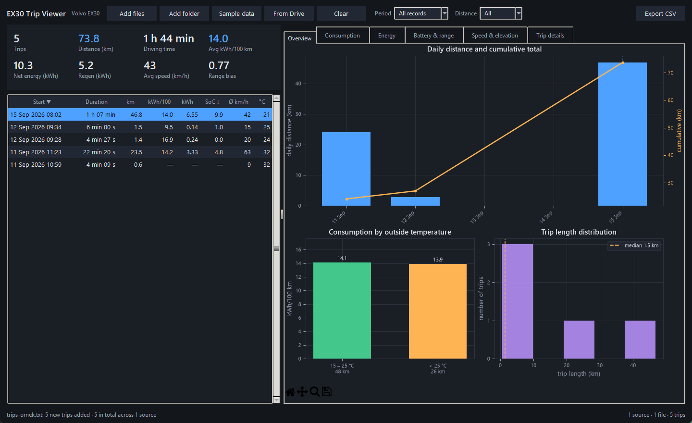
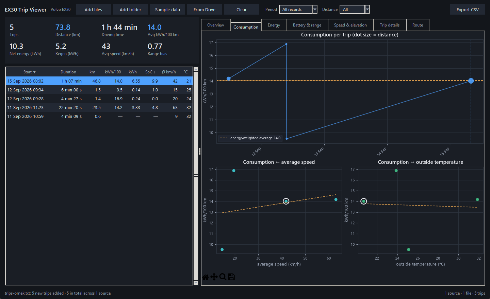
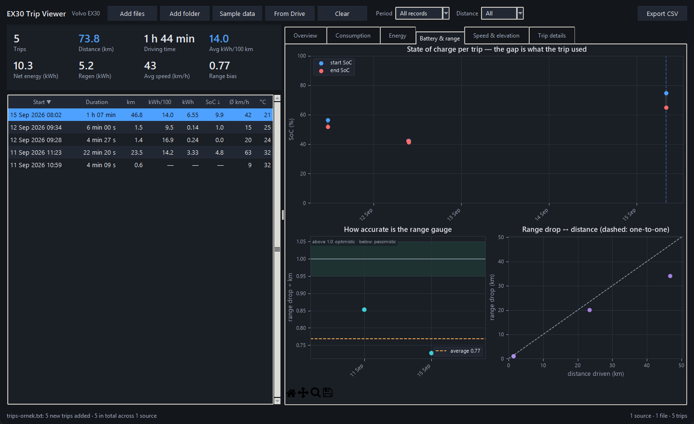

# EX30 Trip Viewer

**English** · [Türkçe](README.tr.md)

A Windows desktop app that turns the trip logs exported from a **Volvo EX30**
(by the in-car app **EX30 Telemetry**) into charts and tables. Python + Tkinter +
matplotlib; no installer, runs straight from the folder.

> **Unofficial project.** Not affiliated with, endorsed by or supported by Volvo
> Cars. "Volvo" and "EX30" are trademarks of their respective owners and are used
> here only to describe compatibility. The software is provided **"as is",
> without warranty of any kind**; values shown are estimates.



<p>
  
  
</p>

<sub>Screenshots use the sample data shipped in this repository (`ornek/trips-ornek.txt`).</sub>

## What it shows

**Left column:** a summary of the filtered set (trips, distance, driving time,
average consumption, net energy, regen, average speed, range bias) and the trip
table. Click a column header to sort, double-click a row to open its details.

**Tabs**

| Tab | Contents |
|---|---|
| Overview | Daily distance + cumulative total, consumption by outside temperature, trip length distribution |
| Consumption | kWh/100 km per trip, consumption vs. average speed, consumption vs. outside temperature |
| Energy | Net + regen = gross stacked bars, regen share, regen vs. descent |
| Battery & range | State of charge start → end per trip, range indicator bias, range drop vs. real distance |
| Speed & elevation | Average vs. max speed, elevation gain/loss, GPS vs. wheel distance |
| Trip details | Every field of the selected trip and its performance records |

The selected trip is highlighted in every chart. Charts can be zoomed and panned;
*File → Save chart as PNG* saves the visible tab. *File → Export table to CSV*
writes the filtered set (UTF-8 with BOM, opens correctly in Excel).

## Run

Requires **Python 3.10+** on Windows (Tkinter is included with the python.org
installer).

```powershell
py -3 -m pip install -r requirements.txt   # matplotlib (brings numpy)
py -3 -m ex30trips                          # or double-click calistir.bat
py -3 -m ex30trips "C:\path\trips-20260915-0909.txt"
py -3 -m ex30trips "C:\Downloads"          # load every export in a folder
py -3 -m ex30trips --lang en
```

Use **Sample data** in the toolbar to try it without a car.

### Getting the data from the car

1. In **EX30 Telemetry**, open the vehicle-data screen and press **Export**. The
   files are written to `Downloads/EX30YolAnalizi/` on the car as
   `trips-YYYYMMDD-HHMM.txt`.
2. Move the file to your PC (for example with **EX30 File Explorer** over
   Bluetooth or Wi-Fi), then open it here with *Add files* or *Add folder*.

**Or, from Google Drive (optional):** if you set up the Drive endpoint described
in the EX30 Telemetry repository ([drive-sync/README.md](https://github.com/Anil-Erke/ex30-telemetry/blob/main/drive-sync/README.md)), press **From Drive**
(Ctrl+D). The URL and the **read key** are asked for on first use and stored only
on your PC in `%LOCALAPPDATA%\EX30TripViewer\drive.json`, never in the code or
the exe. The read key is deliberately different from the car's write key.

### Sources accumulate

*Add files*, *Add folder*, *Sample data* and *From Drive* add to what is already
loaded. The same trip appearing in several sources is counted once (matched by
`startEpoch`; the copy with the newer schema and more fields wins). An unreadable
file does not break the whole load. *Clear* drops everything, *File → Loaded
sources…* removes one source, **F5** reloads all from disk.

## Before you build: things you must fill in

**Nothing.** The app runs as is. The optional Drive settings are entered inside
the app and stay on your PC.

## Language

English and Turkish. Choose from the **Dil / Language** menu; the switch is
instant and remembered. Numbers, dates, units and the CSV format follow the
selected language (`1,234.5` / `1.234,5`, `,` / `;` separator). Strings live in
`ex30trips/lang/en.py` and `lang/tr.py`; a test keeps the two tables in sync.

## Build a standalone exe

```powershell
.\exe-olustur.ps1              # one-file exe in dist\ (~39 MB)
.\exe-olustur.ps1 -Klasor      # folder mode: starts instantly
.\exe-olustur.ps1 -TestleriAtla  # skip tests
.\exe-olustur.ps1 -Temizle     # delete build/, dist/, *.spec
```

The script finds Python, installs missing dependencies, **runs the unit tests
(no exe if they fail)**, generates the icon and packages with PyInstaller.
`exe-olustur.bat` runs it with a double-click. The script is saved as UTF-8
**with BOM**; keep it that way, Windows PowerShell 5.1 needs it for non-ASCII text.

## Data decisions

Definitions match the in-car app (`TripStats.kt`, `RangeAuditor.kt`):

- **Average consumption is energy-weighted**, so a 2 km trip does not count as
  much as a 200 km one.
- **Range bias is distance-weighted** and only uses trips ≥ 5 km, because the
  car's range value changes in 1 km steps.
- `energyKwh` is **net** (used − regenerated); gross = net + regen.
- Bias above 1.0 means the range indicator was optimistic, below 1.0 pessimistic.
- **Missing values are not turned into zero.** They show as "—", are not drawn and
  are left out of averages.

## Tests

```powershell
py -3 -m unittest discover -s tests
```

Covers reading the sample file, missing fields, schema compatibility, merging and
de-duplication, Drive response parsing, weighted averages, both languages
(key/placeholder parity, formats) and that every chart actually renders to PNG in
both languages with full and empty data.

## Layout

```
ex30trips/
  model.py    Trip / PerfRecord (Python twin of trip/Trip.kt)
  loader.py   file reading, folder scan, merging / de-duplication
  stats.py    totals; same definitions as TripStats.kt
  charts.py   matplotlib drawing (no Tkinter dependency)
  theme.py    one palette for ttk + matplotlib
  i18n.py     language selection, t(), number/date/duration/CSV formats
  lang/       tr.py + en.py string tables
  settings.py persistent preferences (language)
  drive.py    optional Google Drive download
  app.py      Tkinter window
main.py       PyInstaller entry point
araclar/      icon generator, environment check
assets/       icon
ornek/        sample export from a car (trip summaries only, no location)
screenshots/  README images
tests/        unit tests
```

Code comments and some file names are in Turkish.

## License

Copyright (C) 2026 Anıl Erke

This program is free software: you can redistribute it and/or modify it under the
terms of the **GNU General Public License** as published by the Free Software
Foundation, either version 3 of the License, or (at your option) any later version
(`GPL-3.0-or-later`).

This program is distributed in the hope that it will be useful, but **WITHOUT ANY
WARRANTY**; without even the implied warranty of MERCHANTABILITY or FITNESS FOR A
PARTICULAR PURPOSE. See the full text in [LICENSE](LICENSE).

In short: you may use, study, modify and share this code. If you distribute a
modified version (including publishing it on an app store), you must release its
source code under the same license.
