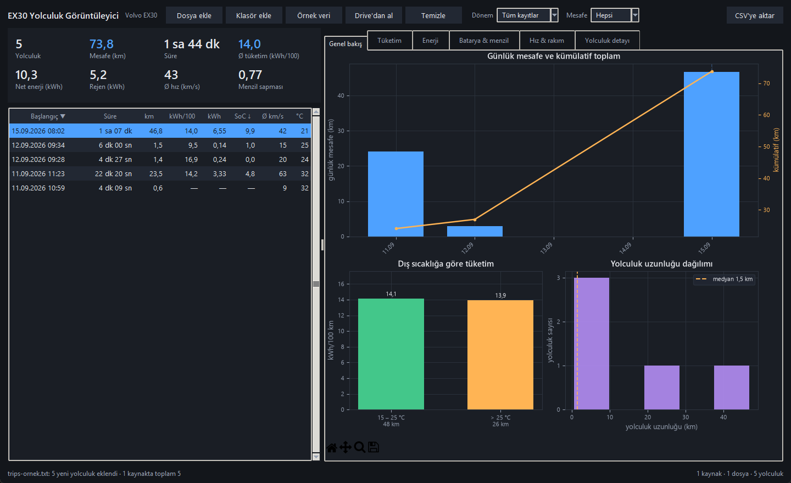
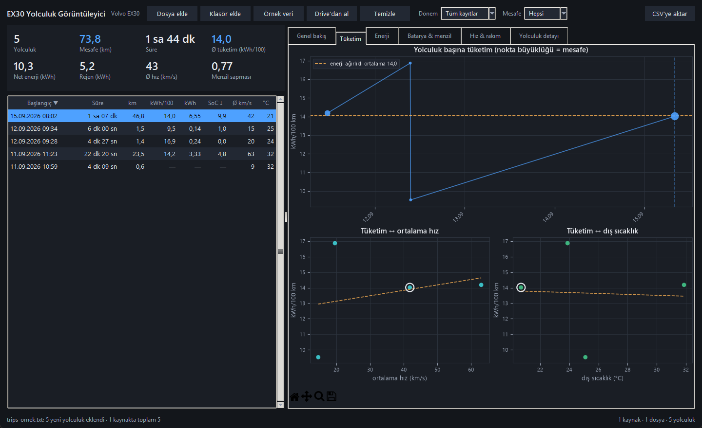
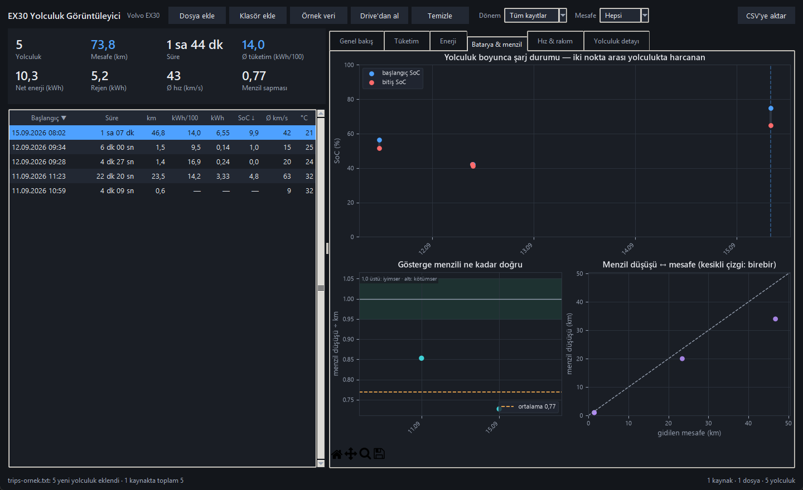

# EX30 Trip Viewer (EX30 Yolculuk Görüntüleyici)

[English](README.md) · **Türkçe**

Volvo EX30'dan dışa aktarılan yolculuk kayıtlarını Windows'ta grafikle gösteren
masaüstü uygulaması. Python + Tkinter + matplotlib; kurulum gerektirmez,
klasörden doğrudan çalışır.

> **Resmî olmayan proje.** Volvo Cars ile bağlantısı yoktur, Volvo tarafından
> onaylanmamış veya desteklenmemektedir. "Volvo" ve "EX30" sahiplerinin ticari
> markalarıdır; burada yalnızca uyumluluğu belirtmek için kullanılır. Yazılım
> **"olduğu gibi", hiçbir garanti olmaksızın** sunulur; gösterilen değerler
> tahminidir.



<p>
  
  
</p>

<sub>Ekran görüntüleri depodaki örnek veriyle (`ornek/trips-ornek.txt`) alındı.</sub>

Araçtaki **EX30 Telemetry** uygulaması yolculukları `trips.json` içine yazıyor
(`trip/TripStore.kt`). Dışa aktarımda dosya `trips-YYYYAAGG-SSDD.txt` adıyla
çıkıyor (`calib/DataExporter.kt`). Bu uygulama o dosyayı okuyor.

## Derlemeden önce doldurmanız gerekenler

**Hiçbiri.** Uygulama olduğu gibi çalışır. İsteğe bağlı *Drive'dan al* özelliği
için adres ve okuma anahtarı uygulamanın içinden (*Dosya → Drive ayarları…*)
girilir ve yalnızca sizin bilgisayarınızda
`%LOCALAPPDATA%\EX30TripViewer\drive.json` içinde saklanır; koda gömülmez.

## Çalıştırma

```
calistir.bat
```

ya da komut satırından:

```
py -3 -m ex30trips
py -3 -m ex30trips "C:\yol\trips-20260915-0909.txt"
py -3 -m ex30trips "C:\indirilenler"
py -3 -m ex30trips --lang en
```

Dosya ya da klasör yolu verilirse açılışta yüklenir.

## Dil / Language

Arayüz **Türkçe** ve **İngilizce**. Menüde **Dil / Language** → *Türkçe* ya da
*English*; seçim anında uygulanır ve kalıcıdır. Başlık iki dilli, dil adları
kendi dillerinde yazılı — yanlış dilde açılan uygulamada da geri dönüş yolu
bulunuyor.

Dil değişince pencere kapanıp açılmıyor: widget'lar yeni dille yeniden
kuruluyor, **yüklü kaynaklar, filtreler, sıralama, seçili yolculuk ve açık
sekme yerinde kalıyor**; hiçbir dosya yeniden okunmuyor.

Açılış dilinin önceliği:

1. `--lang tr|en` — yalnızca o açılış için, kayıtlı seçimi değiştirmez
2. Dil menüsünde yapılan son seçim — `%LOCALAPPDATA%\EX30TripViewer\settings.json`
3. Windows **arayüz** dili (bölge biçimi değil): Türkçeyse Türkçe, değilse İngilizce

Dile bağlı olan yalnızca metin değil:

| | Türkçe | English |
|---|---|---|
| Sayı | 1.234,5 | 1,234.5 |
| Yüzde | %33 | 33% |
| Tarih | 15.09.2026 08:02 | 15 Sep 2026 08:02 |
| Hız | km/s (kilometre/**saat**) | km/h |
| Süre | 1 sa 07 dk | 1 h 07 min |
| CSV | `;` ayraç, ondalık virgül | `,` ayraç, ondalık nokta, ISO tarih |

Ay adları işletim sisteminin yerel ayarından alınmıyor (`strftime("%b")` Türkçe
Windows'ta İngilizce arayüze "Eyl" yazardı); `i18n.py` kendisi kuruyor.

Metinler `ex30trips/lang/tr.py` ve `lang/en.py` tablolarında — araç
uygulamasındaki `values/` + `values-tr/` düzeninin karşılığı. Kod yalnızca
anahtar kullanıyor (`t("menu.file")`). İki tablonun anahtarları ve yer
tutucuları testle eşit tutuluyor; koddaki her anahtarın tabloda olduğu da
denetleniyor. Yeni metin eklerken iki tabloya birden yaz, yoksa test düşer.

İngilizcede tekil/çoğul `{n|trip|trips}` biçimiyle: "1 trip", "5 trips".
Türkçede sayıdan sonra isim çoğul olmadığı için gerekmiyor.

**Tuzak:** bu kod tabanında `t` yolculuk değişkeninin adı. `charts.py`,
`stats.py` ve `model.py` fonksiyonların içinde `t = ...` atıyor; oralarda
çeviri çağrısı `t(...)` yazılırsa Python o fonksiyondaki bütün `t`'leri yerel
sayıp `UnboundLocalError` verir. Bu modüllerde her zaman `i18n.t(...)`.
`app.py`'de `t` çeviri fonksiyonu, yolculuk değişkeni `trip`.

## Kaynaklar birikir

**Dosya ekle**, **Klasör ekle**, **Örnek veri** ve **Drive'dan al** yüklü
kayıtların yerine geçmez, üstüne ekler. Drive'da yalnızca son günler duruyorsa
eski dışa aktarımların olduğu klasörü de ekleyip ikisini tek listede
görebilirsin; grafikler, özet kartları ve CSV hep birleşik kümeyi kullanır.

Aynı yolculuk birden çok kaynakta varsa `startEpoch` ile tekleniyor, bir kez
sayılıyor. Aynı yol ikinci kez seçilirse kaynak çoğalmıyor, tazesiyle
değişiyor — Drive'dan tekrar almak da yüklü Drive kaynağını yeniliyor.

| İşlem | Nerede |
| --- | --- |
| Hepsini bırak | **Temizle** düğmesi · *Dosya → Kayıtları temizle* |
| Tek kaynağı çıkar | *Dosya → Yüklü kaynaklar…* (durum çubuğundaki özete tıklamak da açar) |
| Hepsini diskten yeniden oku | **F5** |

Durum çubuğunun sağı kaç kaynak, kaç dosya, kaç yolculuk yüklü olduğunu ve
kaç yinelenen kaydın elendiğini yazıyor.

## Drive'dan alma

Araçtaki uygulamanın **"Drive'a aktar"** düğmesi kayıtları bir Google Drive
klasörüne yüklüyor. Buradaki **"Drive'dan al"** düğmesi (Ctrl+D) aynı klasörden
`trips.json`'u indirip yüklü kaynaklara ekliyor — dosya taşımak, USB,
telefon yok.

İlk kullanımda adres ve **okuma anahtarı** soruluyor; ikisi de
`%LOCALAPPDATA%\EX30TripViewer\drive.json` içine yazılıyor, kaynağa ya da exe'ye
gömülmüyor. Sonradan değiştirmek için *Dosya → Drive ayarları…*.

Ucun kurulumu EX30 Telemetry deposunda: `drive-sync/README.md`. **Buraya yazılan
anahtar okuma anahtarı**, araçtaki uygulamanın yazma anahtarı değil — ikisi
bilerek ayrı.

İndirilen dosya `%LOCALAPPDATA%\EX30TripViewer\indirilen\trips.json` altında
kalıyor, böylece ağ yokken de F5 ile tekrar açılabiliyor.

## Bağımlılık

Gereken tek bağımlılık
matplotlib (numpy'yi kendisi getiriyor):

```
py -3 -m pip install -r requirements.txt
```

Tkinter, Windows'taki Python kurulumunda hazır gelir.

## Exe üretme

```
.\exe-olustur.ps1
```

Betik sırasıyla Python'u bulur, eksik bağımlılıkları kurar, birim testlerini
çalıştırır, ikonu üretir ve PyInstaller ile paketler. Testler geçmezse derleme
yapılmaz — bozuk kod exe'ye girmesin. Çift tıklamayla çalıştırmak için
`exe-olustur.bat` var (PowerShell politika engeline takılmadan çağırıyor).

| Anahtar | Ne yapar |
|---|---|
| *(yok)* | Tek dosya: `dist\EX30 Yolculuk Görüntüleyici.exe` (~39 MB) |
| `-Klasor` | Klasör kipi: `dist\EX30 Yolculuk Görüntüleyici\…` — exe 8,4 MB, anında açılır |
| `-TestleriAtla` | Testleri çalıştırmadan derler |
| `-Temizle` | `build/`, `dist/` ve `*.spec` siler, derleme yapmaz |
| `-Calistir` | Derleme bitince exe'yi açar |

Tek dosya kipinde exe kendini her açılışta geçici klasöre açıyor; ilk pencere
bu makinede **2,5 saniyede** geldi. Sık açacaksan `-Klasor` daha rahat.

Örnek veri exe'nin içine gömülüyor; paketlenmiş hâlde kaynak yolu
`sys._MEIPASS`'ten çözülüyor (`app.resource_path`), o yüzden "Örnek veri"
düğmesi exe'de de çalışıyor. İkon `assets/ex30.ico` — yoksa `araclar/ikon-uret.py`
Pillow ile üretiyor, palet arayüzle aynı.

Not: PowerShell betiği UTF-8 **BOM ile** kaydedildi. Windows PowerShell 5.1
BOM'suz dosyayı sistem kod sayfasıyla okuyup Türkçe karakterleri bozuyor
(Windows'taki kod sayfası sorununun PowerShell akrabası). Betiği düzenlerken BOM'u
koru.

## Ekranda ne var

**Sol sütun** — filtrelenmiş kümenin özeti (yolculuk sayısı, mesafe, süre,
ortalama tüketim, net enerji, rejen, ortalama hız, menzil sapması) ve yolculuk
tablosu. Sütun başlığına tıklayınca sıralama değişir, satıra çift tıklayınca
detay sekmesi açılır.

**Sağ sekmeler**

| Sekme | Ne gösteriyor |
|---|---|
| Genel bakış | Günlük mesafe + kümülatif toplam, dış sıcaklık bandına göre tüketim, yolculuk uzunluğu dağılımı |
| Tüketim | Yolculuk başına kWh/100 km, tüketim ↔ ortalama hız, tüketim ↔ dış sıcaklık |
| Enerji | Net + rejen = brüt yığılmış bar, rejen payı, rejen ↔ iniş |
| Batarya & menzil | Yolculuk başına SoC başlangıç→bitiş, gösterge menzil sapması, menzil düşüşü ↔ gerçek mesafe |
| Hız & rakım | Ortalama–azami hız, rakım kazancı/kaybı, GPS ↔ tekerlek mesafesi |
| Yolculuk detayı | Seçili yolculuğun bütün alanları ve A4 performans ölçümleri |

Seçili yolculuk bütün grafiklerde vurgulanıyor. Grafiklerin altındaki araç
çubuğuyla yakınlaştırma/kaydırma yapılabiliyor; **Dosya → Grafiği PNG kaydet**
görünen sekmeyi dosyaya basıyor.

## Veriyle ilgili kararlar

Sayılar araçtaki hesapla aynı kalsın diye tanımlar `trip/TripStats.kt` ve
`trip/RangeAuditor.kt`'tan birebir alındı:

- **Ortalama tüketim enerji ağırlıklı.** Yolculuk başına kWh/100 km değerlerinin
  düz ortalaması 2 km'lik bir yolculuğu 200 km'likle aynı ağırlıkta sayardı.
- **Menzil sapması mesafe ağırlıklı** ve yalnızca ≥ 5 km yolculuklarda var:
  `RANGE_REMAINING` gerçek araçta 1 km adımlarla değişiyor, 2 km'lik bir
  yolculukta tek adım oranı %50 saptırıyor.
- **`energyKwh` NET tüketim** (tüketilen − geri kazanılan), `regenKwh` pozitif;
  brüt = net + rejen. Grafiklerde bu yığılmış bar olarak gösteriliyor.
- **Sapma oranı 1,0'ın üstündeyse gösterge iyimser**, altındaysa kötümser.
- **Eksik alan sıfıra çevrilmiyor.** Araç o property'yi vermediyse değer "—"
  görünüyor ve grafikte o nokta hiç çizilmiyor; ortalamalara da girmiyor.
- **GPS mesafesi ile tekerlek mesafesi ayrı tutuluyor** (şema 3). İkisinin oranı
  GPS hatasının tek ölçüsü, o yüzden kendi grafiği var.

Birden çok dışa aktarım aynı anda açılabilir (çoklu seçim, klasör ya da
birbirinin üstüne eklenen kaynaklar). Aynı yolculuk iki dosyada varsa
`startEpoch` ile tekleniyor; şeması yeni ve alanı daha dolu olan kopya
tutuluyor, böylece eski bir yedek yeni kaydı ezmiyor. Okunamayan dosya bütün
yüklemeyi düşürmüyor, durum çubuğunda sayısı yazıyor; yeni bir kaynak hiç
okunamazsa ekranda duran kayıtlara dokunulmuyor.

## CSV

**Dosya → Tabloyu CSV'ye aktar** filtrelenmiş kümeyi yazar, kodlama UTF-8 BOM.
Biçim arayüz diline göre: Türkçede ayraç `;` ve ondalık virgül, İngilizcede `,`
ve ondalık nokta, tarih ISO (`2026-09-15 08:02:12`). Excel ayracı sistemin yerel
ayarından okuduğu için her iki durumda da çift tıklayınca sütunlar ve sayılar
doğru ayrılıyor; başlıklar da seçili dilde.

## Klasör düzeni

```
ex30trips/
  model.py    Trip / PerfRecord — trip/Trip.kt'nin Python karşılığı
  loader.py   dosya okuma, klasör tarama, kaynakları birleştirme/tekleme
  stats.py    toplamlar; TripStats.kt ile aynı tanımlar
  charts.py   matplotlib çizimleri (pencereyi tanımaz)
  theme.py    tek renk paleti: ttk + matplotlib
  i18n.py     dil seçimi, t(), sayı/tarih/süre/CSV biçimleri
  lang/       tr.py + en.py — metin tabloları
  settings.py kalıcı tercihler (dil)
  app.py      Tkinter penceresi
main.py       PyInstaller giriş betiği (paket mantığı ex30trips'te)
araclar/      ikon üretici, ortam denetleyici
assets/       ex30.ico + önizleme
ornek/        araçtan çıkmış örnek dışa aktarım
screenshots/  README görselleri
tests/        birim testleri
```

`charts.py` Tkinter'ı hiç tanımıyor: çizimler `Figure` alıp ona çiziyor, bu
yüzden pencere açmadan PNG'ye basılabiliyor ve test edilebiliyor.

## Test

```
py -3 -m unittest discover -s tests
```

47 test: gerçek örnek dosyanın okunması, eksik alanların None kalması, şema 1
uyumluluğu, birleştirmede zengin kopyanın kazanması, bozuk dosyanın yüklemeyi
düşürmemesi, kaynakların birikmesi, Drive yanıtının çözümlenmesi, enerji
ağırlıklı ortalama ve mesafe ağırlıklı menzil sapması.

Dil testleri (I18nTests): iki tablonun anahtar ve yer tutucu eşitliği, koddaki
her anahtarın tabloda olması, iki dilde sayı/tarih/süre/CSV biçimleri, çoğul
seçimi, hata mesajlarının `str()` anındaki dilde çıkması, açılış dili önceliği
ve **her grafiğin iki dilde, dolu ve boş veriyle gerçekten PNG'ye çizilmesi** —
çeviri çağrıları çizim sırasında çalıştığı için hata ancak orada görünüyor.

Eksen testleri (ChartAxisTests): iki dilde, her grafikte, çok günlük / iki
günlük / tek günlük veride ve yakınlaştırılmış eksende hiçbir etiketin
yinelenmemesi. Tarih ekseninde etiketin ayrıntısı (gün, saat, gün+saat, ay)
verinin yayıldığı aralıktan değil **tiklerin gerçek aralığından** seçiliyor;
yolculuk başına barlarda aynı güne düşen iki yolculuk saatle ayrılıyor.

## Lisans

Copyright (C) 2026 Anıl Erke

Bu program özgür yazılımdır: Özgür Yazılım Vakfı tarafından yayımlanan **GNU Genel
Kamu Lisansı**'nın 3. sürümü ya da (tercihinize göre) daha sonraki bir sürümü
koşulları altında yeniden dağıtabilir ve/veya değiştirebilirsiniz
(`GPL-3.0-or-later`).

Bu program faydalı olması umuduyla dağıtılmaktadır, ancak **HİÇBİR GARANTİSİ
YOKTUR**; SATILABİLİRLİK veya BELİRLİ BİR AMACA UYGUNLUK zımni garantisi dahi
yoktur. Bağlayıcı olan, [LICENSE](LICENSE) dosyasındaki İngilizce tam metindir.

Kısacası: bu kodu kullanabilir, inceleyebilir, değiştirebilir ve paylaşabilirsiniz.
Değiştirilmiş bir sürümü dağıtırsanız (uygulama mağazasında yayınlamak dahil),
onun kaynak kodunu da aynı lisansla açmanız gerekir.
